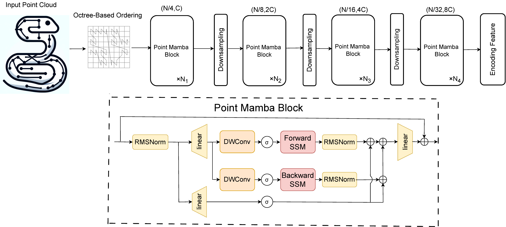

<div  align="center">    
 
</div>


<div align="center">
<h1>Point Mamba</h1>
<h3>A Novel Point Cloud Backbone Based on State Space Model with Octree-Based Ordering Strategy</h3>


# Overview

<div  align="center">    
 
</div>

<div align="left">

## News
- 2024/3/11 Release our code and checkpoint for semantic segmentation for Scannet
## 1. Environment

The code has been tested on Ubuntu 20.04 with 3 Nvidia 4090 GPUs (24GB memory).

1. Python 3.10.13
    ```bash
    conda create -n your_env_name python=3.10.13
    ```

2. Install torch 2.1.1 + cu118

    ```bash
    pip install torch==2.1.1 torchvision==0.16.1 torchaudio==2.1.1 --index-url https://download.pytorch.org/whl/cu118
    ```

3. Clone this repository and install the requirements.

    ```bash
    pip install -r requirements.txt
    ```

4. Install the library for octree-based depthwise convolution.

    ```bash
    git clone https://github.com/octree-nn/dwconv.git
    pip install ./dwconv
    ```

5. Install ``causal-conv1d`` and ``mamba``, which you can download in this [link](https://sjtueducn-my.sharepoint.com/:u:/g/personal/yj1938_sjtu_edu_cn/EfvXT20i7IBPsw_KR47ok3wB0l531kf7DMQwJWjdnPxlkQ?e=iDhOe9)
    ```bash
    pip install -e causal-conv1d
    pip install -e mamba
    ```

## 2. ScanNet Segmentation

1. **Data**: Download the data from the
   [ScanNet benchmark](https://kaldir.vc.in.tum.de/scannet_benchmark/).
   Unzip the data and place it to the folder <scannet_folder>. Run the following
   command to prepare the dataset.

    ```bash
    python tools/seg_scannet.py --run process_scannet --path_in scannet
    ```
    The filelist should be like this:
    ```bash

    ├── scannet
    │ ├── scans
    │ │ ├── [scene_id]
    │ │ │ ├── [scene_id].aggregation.json
    │ │ │ ├── [scene_id].txt
    │ │ │ ├── [scene_id]_vh_clean.aggregation.json
    │ │ │ ├── [scene_id]_vh_clean.segs.json
    │ │ │ ├── [scene_id]_vh_clean_2.0.010000.segs.json
    │ │ │ ├── [scene_id]_vh_clean_2.labels.ply
    │ │ │ ├── [scene_id]_vh_clean_2.ply
    │ ├── scans_test
    │ │ ├── [scene_id]
    │ │ │ ├── [scene_id].aggregation.json
    │ │ │ ├── [scene_id].txt
    │ │ │ ├── [scene_id]_vh_clean.aggregation.json
    │ │ │ ├── [scene_id]_vh_clean.segs.json
    │ │ │ ├── [scene_id]_vh_clean_2.0.010000.segs.json
    │ │ │ ├── [scene_id]_vh_clean_2.ply
    │ ├── scannetv2-labels.combined.tsv
    ```

2. **Train**: Run the following command to train the network with 3 GPUs and port 10001. The mIoU on the validation set without voting is 75.0. And the training log and weights can be download in [link](https://sjtueducn-my.sharepoint.com/:u:/g/personal/yj1938_sjtu_edu_cn/EfvXT20i7IBPsw_KR47ok3wB0l531kf7DMQwJWjdnPxlkQ?e=iDhOe9)

    ```bash
    python scripts/run_seg_scannet.py --gpu 0,1,2 --alias scannet --port 10001
    ```

3. **Evaluate**: Run the following command to get the per-point predictions for the validation dataset with a voting strategy. And after voting, the mIoU is 75.7 on the validation dataset.

    ```bash
    python scripts/run_seg_scannet.py --gpu 0 --alias scannet --run validate
    ```
## 3. ModelNet40 Classification (Point Mamba(O))

1. **Data**: Run the following command to prepare the dataset.

    ```bash
    python tools/cls_modelnet.py
    ```

2. **Train**: Run the following command to train the network with 1 GPU. The classification accuracy on the testing set without voting is 92.7%. The code for Point Mamba(C) will be released in another branch later.
   Checkpoints will be released later.
    ```bash
    python classification.py --config configs/cls_m40.yaml SOLVER.gpu 0,
    ```

## 4. Acknowledegment 
Our project is based on 
- Mamba ([paper](https://arxiv.org/abs/2312.00752), [code](https://github.com/state-spaces/mamba))
- Octformer([paper](https://arxiv.org/abs/2305.03045), [code](https://github.com/octree-nn/octformer))
- Point Cloud Transformer([paper](https://arxiv.org/abs/2012.09688), [code](https://github.com/MenghaoGuo/PCT))

Thanks for their wonderful works!